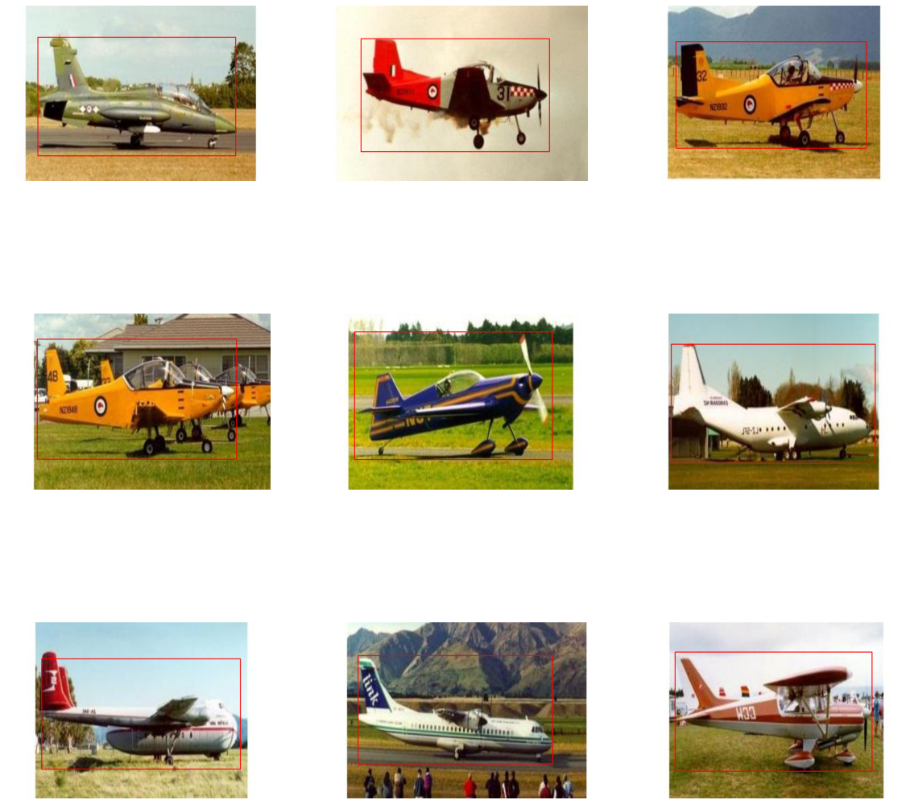
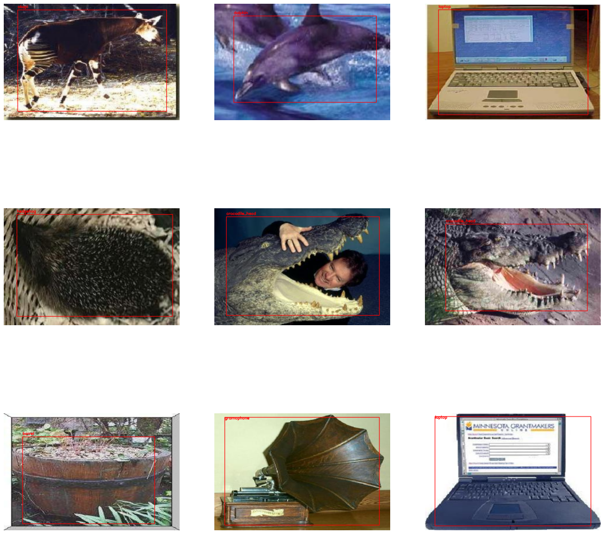
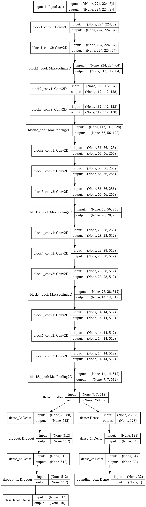

## Bouding Box Regression  
### Overview  
Here, I have trained two CNN architectures :  
 - One predicts bounding boxes of a single class - Airplanes as shown below  
 Notebook : ```bounding_box_regressor.ipynb```  
 

 - The other is fine tuned for predicting class labels as well as boxes for 5 different classes chosen at random from the CALTECH101 dataset.  
 The link to the dataset, necessary preprocessing can be found out in ```multiclass_bounding_box.ipynb```  
   

### Model Architecture  
  <br/><br/>
As seen above it has two output branches, one predicts the coordinates of bounding boxes and other is used to predict the labels.  
Knowing the labels helps the regressor to improve its results. As unsupervised regression is slower the cause being a naive loss function.  

Code courtesy : [PyImageSearch](https://www.pyimagesearch.com/2020/10/12/multi-class-object-detection-and-bounding-box-regression-with-keras-tensorflow-and-deep-learning/)
